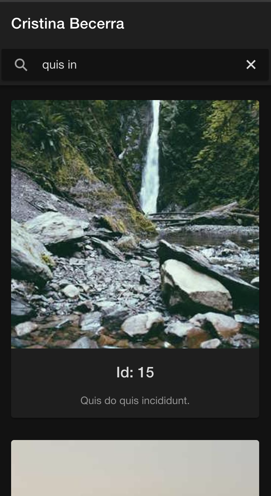
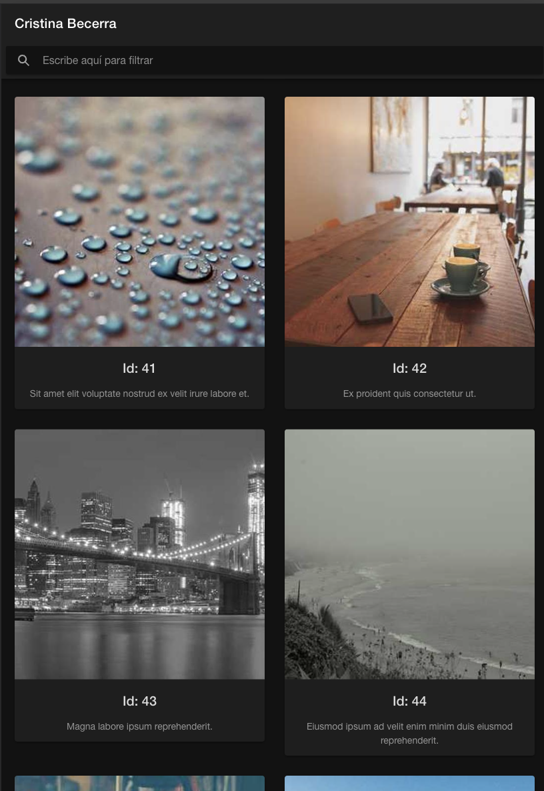

# IteriamImages
Aplicación que carga 4.000 imágenes, muestra 25 inicialmente en pantalla y cuando se hace scroll hasta la última, carga las 25 siguientes.
Resumen de implementaciones:

- Se han realizado test unitarios a todos los servicios creados.
- Según los requisitos de la prueba, un método del servicio `image.service.ts` genera dinámicamente las 4.000 imágenes que serán almacenadas en el componente que las requiera. 
- La carga de las mismas en pantalla se produce de 25 en 25. Cuando la última es visualizada, cargan las 25 siguientes usando `infinite scroll`.
- En el archivo `random-text.service` se genera aleatoriamente el texto de cada imagen usando una libreria externa.
- A pesar de que la aplicación se ha diseñado para usar en móvil, se adapta a todas las resoluciones de forma responsive.
- Se puede filtrar el contenido por id y texto.
- Si alguna imagen no se visualiza correctamente, se usa otra por defecto.

### Capturas de pantalla

<i>Visualización de la aplicación</i>
  

  
  

<i>Filtrado por texto o id</i>
  

  
  

<i>Responsive ante diferentes resoluciones</i>

